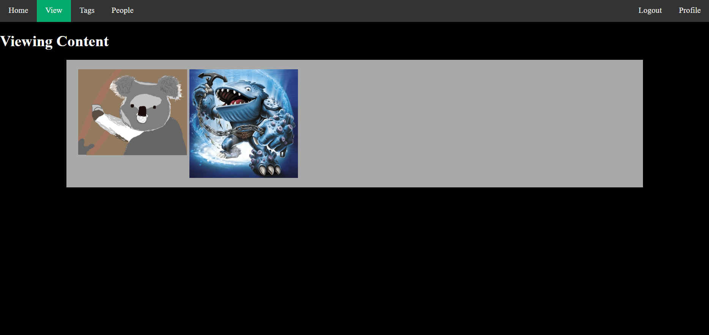
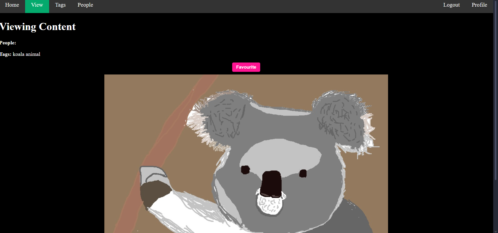

# Introduction
A simple image board style site to practice various parts of web development. During my research, [go8](https://github.com/gmhafiz/go8/tree/master) and [golang-api-showcase](https://github.com/eldimious/golang-api-showcase/tree/master) were my starting foundation to building a Go backend.

# Motivation
With most of my current experience being in systems level development, I wanted to try gaining some practical experience in web development and decided to make a simple website. Having my own catalogue of pictures from vacations and other memories, I figured making an image board style site could help me learn skills that carry over into structuring them in a more accessible, tag-based file structure.

# Stuff
Below are some screenshots of the site's current state:

# Tools Used
Currently, I've used Go with ent + chi for the backend, while having static HTML files served with some CSS and js attached. I'm also currently using [Tagify](https://github.com/yairEO/tagify) for selecting artists and tags for a post. I'm also using a PostgreSQL database.

# Current Features
  - [x] Support for posts to contain image data
  - [x] Navigation bar
  - [x] Viewing a list of all posts
  - [x] Viewing a list of all tags
  - [x] Viewing a list of all artists
  - [x] Registering an account
  - [x] Confirming passwords entered in fields both match
  - [x] Hashing password with bcrypt to store hash instead of plain password in database
  - [x] Logging in and creating a cookie based session
  - [x] Logging out and deleting a cookie based session
  - [x] Adding posts when logged in
  - [x] Viewing uploads when logged in
  - [x] Viewing favourited posts when logged in

# Planned Features
Currently planned future features include:
  - [] Support for posts to contain audio, video, and book/compilation data
  - [] The ability to favourite posts
  - [] The ability to download posts
  - [] The ability to delete your own posts
  - [] The ability to update your own posts
  - [] Adding timeouts for sessions in both cookie and database
  - [] The ability to filter posts by search on titles
  - [] The ability to filter posts by search on tags
  - [] The ability to filter posts by search on artists
  - [] The ability to filter posts by search on a combination of titles, tags, and artists
  - [] Add admin functionality to add/update/delete any post, tag, artist, or user
  - [] Add pagination to the post list view
  - [] Add a logger to the backend
  - [] Redis for caching
  - [] ElasticSearch for complex post searches
  - [] A settings option to customize/personalize website view

# Routes
GET   /                    /internal/server/router@initRoutes

GET   /register            /internal/domain/user/handler/handler@DisplayRegister
POST  /register            /internal/domain/user/handler/handler@Register

GET   /register            /internal/domain/session/handler/handler@DisplayLogin
POST  /register            /internal/domain/session/handler/handler@Login

GET   /register            /internal/domain/session/handler/handler@DisplayLogout
POST  /register            /internal/domain/session/handler/handler@Logout

GET   /view/posts          /internal/domain/post/handler/handler@ListPosts
GET   /view/posts/{id}     /internal/domain/post/handler/handler@ViewPost
GET   /view/tags           /internal/domain/tag/handler/handler@ListTags
GET   /view/artists        /internal/domain/artist/handler/handler@ListArtists

GET   /profile             /internal/domain/user/handler/handler@Profile
GET   /profile/create      /internal/domain/post/handelr/handler@ViewAddPost
POST  /profile/create      /internal/domain/post/handler/handler@AddPost
GET   /profile/uploads     /internal/domain/post/handler/handler@ListUserPosts
GET   /profile/favourites  /internal/domain/post/handler/handler@ListUserFavs